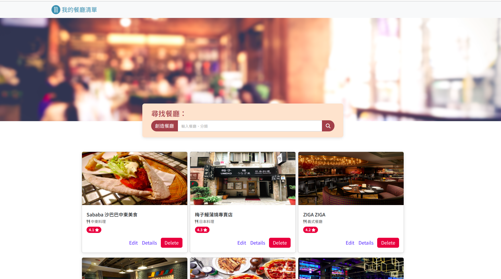

# RestaurantMenu

## 專案畫面


## Features - 產品功能

紀錄屬於自己的餐廳清單，可以瀏覽餐廳、查看詳細資訊、甚至連結到地圖。(請詳閱下方：CRUD功能展示)

功能
- 新增新餐廳資：
- 查看所有餐廳
- 瀏覽餐廳的詳細資訊(點擊餐廳卡片)
- 可變換卡片排序
- 連結餐廳的地址到 Google 地圖
- 搜尋特定餐廳
- 依照餐廳類別搜尋餐廳
- 搜尋失敗產生特殊doge網頁
- 編輯餐廳資訊
- 刪除餐廳資訊

## Environment SetUp - 環境建置
- Node.js 18.16.0
- Express 4.18.2
- Express-Handlebars 7.0.7
- Bootstrap 5.2.4
- Font-awesome 6.4.0

## Installing - 專案安裝流程

1. 請先確認有安裝 node.js 與 npm
2. 創造一個專案資料夾，打開您的 terminal，使用`cd`指令進入您剛創建的資料夾
3. Clone 此專案至本機電腦將專案 clone 到本地
    ```
    git clone https://github.com/TinyMurky/RestaurantMenu.git
    ```
4. 在本地開啟之後，透過終端機進入資料夾，輸入：
    ```
    npm install
    ```
5. 我們需要連結到MongoDB，您需要先於[MongoDB](https://www.mongodb.com/)建立您的Cluster，並於畫面左上角的Database=>Connect 取得雲端DB連結。

    
6. 建立Cluster後，在本專案的根目錄中建立`.env`檔案，並於其中輸入連接您的資料庫，請把以下的`<>`內的資訊替代成您的資訊（`<>`不需要留）
    ```
    mongodb+srv://<您的帳號名稱>:<password>@<您的Cluster連結>/restaurants?retryWrites=true&w=majority
    ```
7. 於`/models/seeds/restaurants.json`中已建立預設餐廳資料，請於專案根目錄中使用終端機輸入以下指令，將預設資料輸入您的資料庫。
    ```
    npm run seed
    ```

8. 完畢後，繼續於終端機輸入：
    ```
    npm run start
    ```
9. 若看見此行訊息則代表順利運行，打開瀏覽器進入到以下網址:
    ```
    Server http://localhost:3000 started.
    ```
10. 若欲暫停請於終端機使用:
    ```
    ctrl + c
    ```

## CRUD功能展示
### Create 新增一家餐廳

點擊搜尋欄位左邊的創造餐廳，進入新增餐廳欄位，每一格，資訊皆為必須輸入，並有各種輸入規則，若違反規則或未輸入，會於送出時紅字提示。創建後導回主頁面，餐廳資訊存於MongoDB，並於畫面最下方顯示。

### Read 搜尋並存取特定一家餐廳資訊
#### 搜尋

可藉由中文、英文店家名稱(使用資料庫中的name_en資料)搜尋，也可以使用餐廳類別(如:義式餐廳)搜尋。若搜尋空字串會呈現所有餐廳，若搜尋不到會出現特殊畫面。

#### 存取特定店家詳細資訊

於主頁面點擊餐廳圖片或是`Details`連結可閱讀特定店家資訊。

### Update 編輯參廳

點擊餐廳卡片上的`Edit`按鈕進入編輯頁面，畫面與新增餐廳相同，但是餐廳原資訊已展現於各輸入格中方便編輯，資料輸入規則與新增相同，送出編輯後可於主頁面與Details看到更改後的結果。

### Delete 刪除餐廳

點擊主畫面餐廳卡片上的`Delete`按鈕將會刪除該餐廳，並從資料庫中刪除

## 排序功能展示

可於主畫面或搜尋後的結果排序卡片順序。
## 開發人員
- TinyMurky
- Alpha Camp

