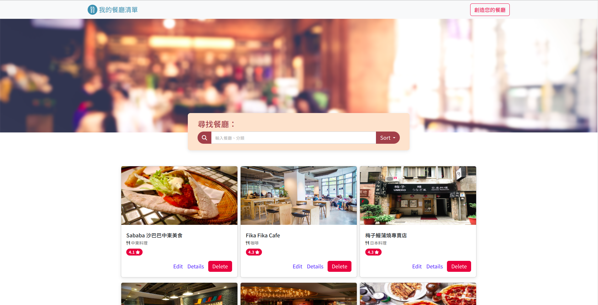
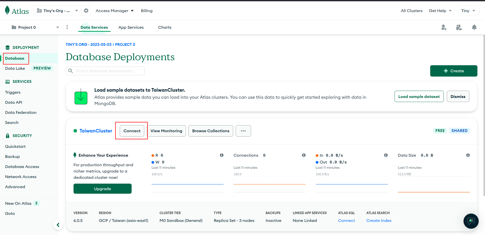
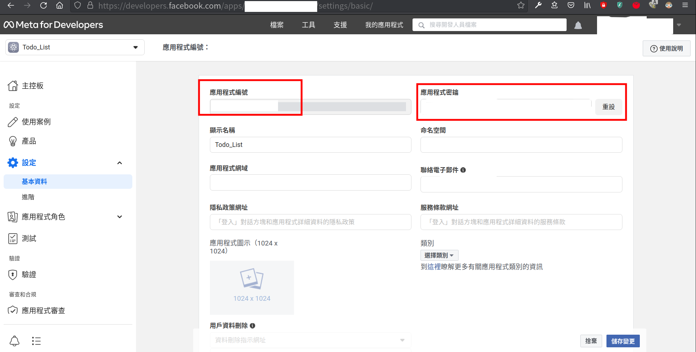
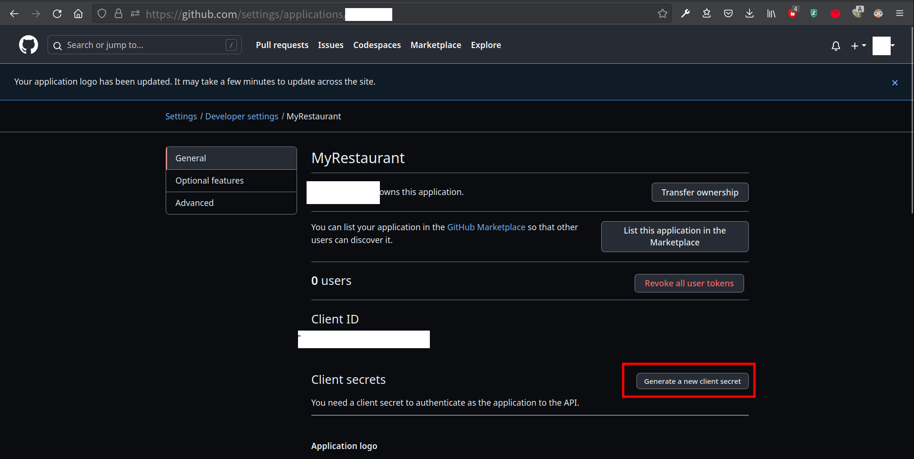
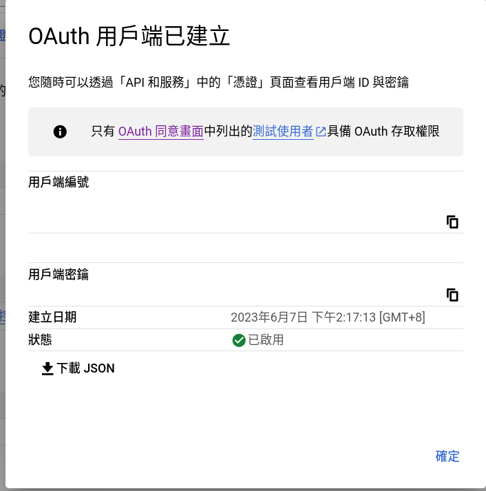
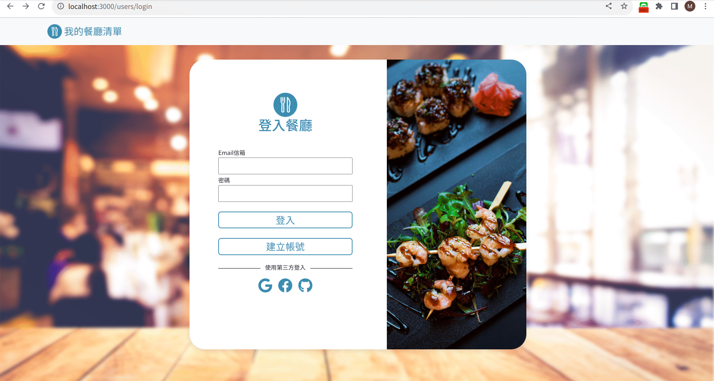
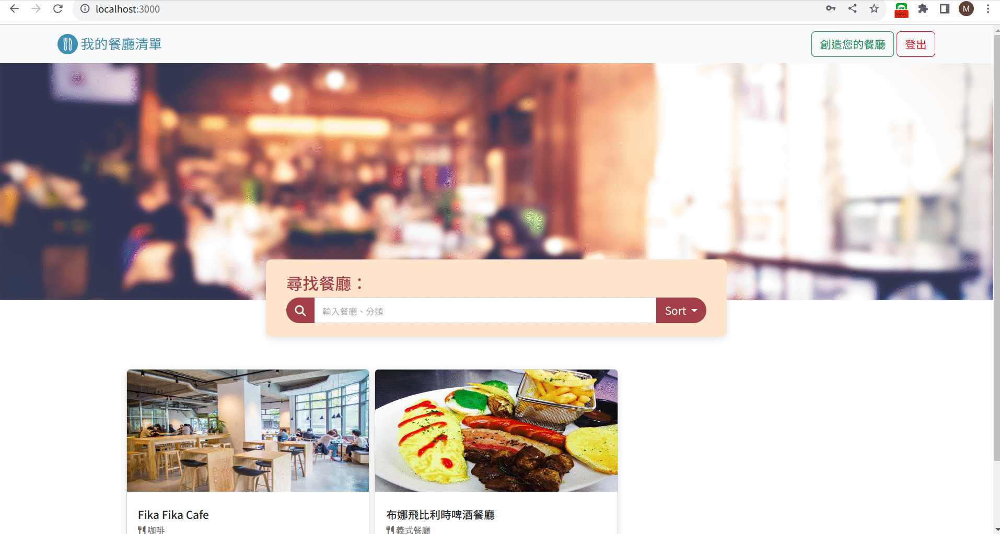

# RestaurantMenu

## 專案畫面


## Features - 產品功能

紀錄屬於自己的餐廳清單，可以瀏覽餐廳、查看詳細資訊、甚至連結到地圖。(請詳閱下方：CRUD功能展示)

功能
- Login/Register
    - 未登入前進入主畫面會被導回登入頁面，並出現警示訊息要求登入
    - 可使用email與密碼註冊帳號，密碼經過bcrypt加密儲存於MongoDB
    - 可使用Google, Facebook, Github註冊與登入
    - 註冊時未填寫email或密碼與確認密碼不相符會有警示資訊
    - 登入時email與密碼不相符會出現警示訊息
- CRUD
    - 新增新餐廳資訊
    - 查看所有餐廳
    - 瀏覽餐廳的詳細資訊(點擊餐廳卡片)
    - 可變換卡片排序
    - 連結餐廳的地址到 Google 地圖
    - 搜尋特定餐廳
    - 依照餐廳類別搜尋餐廳
    - 搜尋失敗產生特殊doge網頁
    - 編輯餐廳資訊
    - 刪除餐廳資訊


## Installing - 專案安裝流程

1. 請先確認有安裝 node.js 與 npm
2. 創造一個專案資料夾，打開您的 terminal，使用`cd`指令進入您剛創建的資料夾
3. Clone 此專案至本機電腦將專案 clone 到本地
    ```
    git clone https://github.com/TinyMurky/RestaurantMenu.git
    ```
4. 在本地開啟之後，透過終端機進入資料夾，輸入：
    ```
    npm install
    ```
5. 我們需要連結到MongoDB，您需要先於[MongoDB](https://www.mongodb.com/)建立您的Cluster，並於畫面左上角的Database=>Connect 取得雲端DB連結。

    
6. 接著我們需要建立.env檔設定環境變數，根目錄檔案`.env.example`可以看到示範檔案，如下所示，填寫
    ```
    FACEBOOK_APP_ID=SKIP
    FACEBOOK_APP_SECRET=SKIP
    FACEBOOK_CALLBACK='http://localhost:3000/auth/facebook/callback'
    GITHUB_CLIENT_ID=SKIP
    GITHUB_CLIENT_SECRET=SKIP
    GITHUB_CALLBACK='http://localhost:3000/auth/github/callback'
    GOOGLE_CLIENT_ID=SKIP
    GOOGLE_CLIENT_SECRET=SKIP
    GOOGLE_CALLBACK='http://localhost:3000/auth/google/callback'
    MONGODB_URL=mongodb+srv://<您的帳號名稱>:<password>@<您的Cluster連結>/restaurants?retryWrites=true&w=majority
    PORT=3000
    SECRET_SESSION_WORD="ThisIsMySecret"
    ```
    - FACEBOOK_APP_ID, FACEBOOK_APP_SECRET 請於[meta for developer](https://developers.facebook.com/)申請一組應用程式編號與應用程式密鑰
    
    - GITHUB_CLIENT_ID, GITHUB_CLIENT_SECRET 請於 [Github register a new OAuth application](https://github.com/settings/applications/new) 申請一組Client ID與Client secrets，申請時請於`Authorization callback URL` 填寫`http://localhost:3000/auth/github/callback
    
    - GOOGLE_CLIENT_ID, GOOGLE_CLIENT_SECRET請於 [Google Developers Console](https://console.cloud.google.com/projectselector2/apis/dashboard?pli=1&supportedpurview=project)申請一組OAuth 2.0用戶端ID與金鑰，設定時`已授權的重新導向URI`請填寫`http://localhost:3000/auth/google/callback`
    
    - 於第5點建立Cluster後，請把.env中`MONGODB_URL`以下的`<>`內的資訊替代成您的資訊（`<>`不需要留）
        ```
        mongodb+srv://<您的帳號名稱>:<password>@<您的Cluster連結>/restaurants?retryWrites=true&w=majority
        ```
7. 於`/models/seeds/restaurants.json`中已建立預設餐廳資料，請於專案根目錄中使用終端機輸入以下指令，將預設資料輸入您的資料庫。
    ```
    npm run seed
    ```
    seed提供三組預設帳號體驗
    
    ||Name|Email|Password|
    |:--|:--|:--|:--|
    |1|user1|user1@example.com|12345678|
    |2|user2|user2@example.com|12345678|
    |3|root|root@example.com|12345678|
8. 完畢後，繼續於終端機輸入：
    ```
    npm run start
    ```
9. 若看見此行訊息則代表順利運行，打開瀏覽器進入到以下網址:
    ```
    Server http://localhost:3000 started.
    ```
10. 若欲暫停請於終端機使用:
    ```
    ctrl + c
    ```
## 登入功能展示
### RWD頁面
RWD設計於螢幕寬度776px時更改畫面布局，提供手機螢幕使用。

### 註冊帳戶
可於註冊頁面註冊帳戶後於登入畫面登入

### 未登入阻擋
未登入的狀態嘗試進入主畫面，將被導回登入畫面並提示訊息

### 註冊與登入輸入錯誤提示
於註冊或登入頁面輸入錯誤資訊將有提示訊息

### 可使用第三方註冊與登入
可使用Google, Github與Facebook進行登入

### 登出功能
進入主畫面後可於右上角選擇登出功能

## CRUD功能展示
### Create 新增一家餐廳

點擊搜尋欄位左邊的創造餐廳，進入新增餐廳欄位，每一格，資訊皆為必須輸入，並有各種輸入規則，若違反規則或未輸入，會於送出時紅字提示。創建後導回主頁面，餐廳資訊存於MongoDB，並於畫面最下方顯示。

### Read 搜尋並存取特定一家餐廳資訊
#### 搜尋

可藉由中文、英文店家名稱(使用資料庫中的name_en資料)搜尋，也可以使用餐廳類別(如:義式餐廳)搜尋。若搜尋空字串會呈現所有餐廳，若搜尋不到會出現特殊畫面。

#### 存取特定店家詳細資訊

於主頁面點擊餐廳圖片或是`Details`連結可閱讀特定店家資訊。

### Update 編輯參廳

點擊餐廳卡片上的`Edit`按鈕進入編輯頁面，畫面與新增餐廳相同，但是餐廳原資訊已展現於各輸入格中方便編輯，資料輸入規則與新增相同，送出編輯後可於主頁面與Details看到更改後的結果。

### Delete 刪除餐廳

點擊主畫面餐廳卡片上的`Delete`按鈕將會刪除該餐廳，並從資料庫中刪除

## 排序功能展示

可於主畫面或搜尋後的結果排序卡片順序。


## Environment SetUp - 環境建置
- By NPM
    - bcryptjs: 2.4.3
    - connect-flash: 0.1.1
    - dotenv: 16.0.3
    - express: 4.18.2
    - express-handlebars: 7.0.7
    - express-session: 1.17.3
    - method-override: 3.0.0
    - mongoose: 7.1.0
    - passport: 0.6.0
    - passport-facebook: 3.0.0
    - passport-github2: 0.1.12
    - passport-google-oauth20: 2.0.0
    - passport-local: 1.0.0
- Other Resources
    - bootstrap 5.2.4
    - font-awesome 6.4.0

## 開發人員
- TinyMurky
- Alpha Camp

